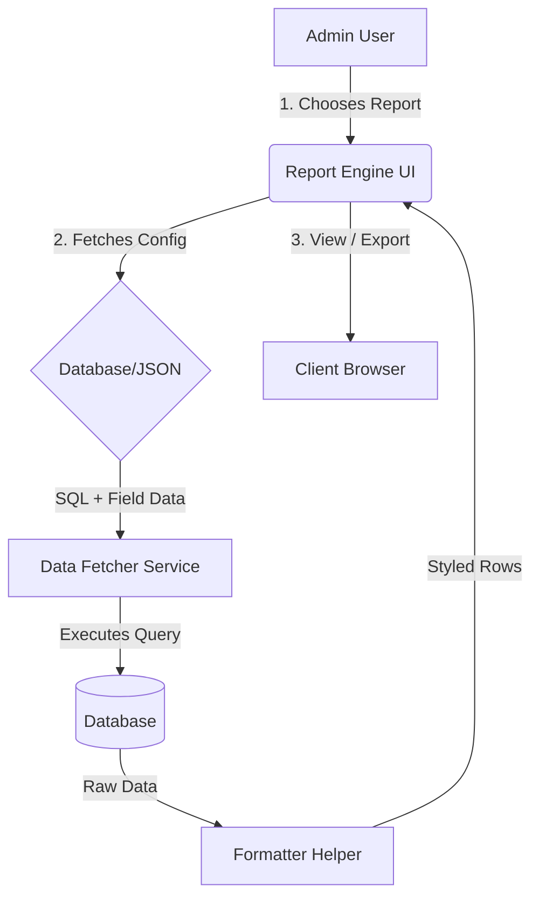

# Proposal: Custom Report Builder & Dynamic Reporting Engine

## 1. Overview
The current system contains 40+ individual report files, many of which share identical logic for filtering, data fetching, and exporting. This proposal outlines a move toward a **Custom Report Builder (Dynamic Engine)** to simplify maintenance, enhance user flexibility, and reduce code duplication by ~70%.

---

## 2. The Problem Statement
*   **Maintenance Burden**: Any global change (e.g., adding a "Date Range" filter or updating the Excel export library) requires manual edits in 40+ different files.
*   **Static Nature**: Users cannot choose which columns they want to see; they are restricted to the fixed columns defined in each file.
*   **Slow Development**: Creating a "new" report requires copying an existing file and modifying the SQL, which leads to inconsistent code patterns over time.

---

## 3. Proposed Solution: Dynamic Reporting Engine
Instead of creating individual `.php` files for every report, we will build a single **Engine** that renders reports based on a **Configuration**.

### Core Components:
1.  **Report Configuration (JSON/DB)**: Each report is defined by its metadata:
    *   Query (SQL)
    *   Applicable Filters (Date range, Class, Mode, etc.)
    *   Selectable Columns
    *   Data Formatting Rules (Currency, Date format, Badges)
2.  **Generic UI Template**: A single PHP file that reads the configuration and renders:
    *   The filter section dynamically.
    *   The data table with user-selected columns.
    *   The Export (Excel/PDF) and Print buttons.
3.  **Report Builder Interface (For Super Admins)**:
    *   A drag-and-drop or checklist-based UI where admins can "Build" a report by selecting fields from the database.

---

## 4. Technical Architecture

### Proposed Structure:
*   `/modules/reports/engine/`
    *   `viewer.php`: The main entry point for all dynamic reports.
    *   `builder.php`: Interface to create new report configurations.
    *   `configs/`: Directory containing JSON files for each report (optional alternative to DB).

---

## 5. Key Features
*   **Dynamic Column Selection**: Users can hide/show columns before exporting.
*   **Global Filters**: Standardized filters for Date, School, Course, and Student Group across all reports.
*   **Advanced Exports**: One-click Excel/PDF generation using centralized libraries (XLSX.js, Print.js).
*   **Security**: Role-based access control integrated into the engine.

---

## 6. Benefits
| For the Client | For the Development Team |
| :--- | :--- |
| **Self-Service**: Create simple reports without waiting for developers. | **Zero Duplication**: Fix a bug once, and it's fixed in every report. |
| **Faster UI**: Modern, consistent, and responsive report layouts. | **Faster Onboarding**: New developers don't need to learn 40 different files. |
| **Consistency**: Totals and data logic remain uniform across the platform. | **Scalability**: Adding 10 new reports takes minutes, not days. |

---

## 7. Phase-wise Implementation Plan
1.  **Phase 1 (Config Migration)**: Migrate the existing 40+ reports into configuration objects and the new Dynamic Engine format.
2.  **Phase 2 (User Builder)**: Release the "Custom Report Builder" UI for the client to create their own ad-hoc reports.

---

> [!IMPORTANT]
> This transition does not mean we delete all old files immediately. We can follow a **Hybrid Approach** where the new engine handles 90% of reports, while highly specialized/custom reports remain as standalone files.
