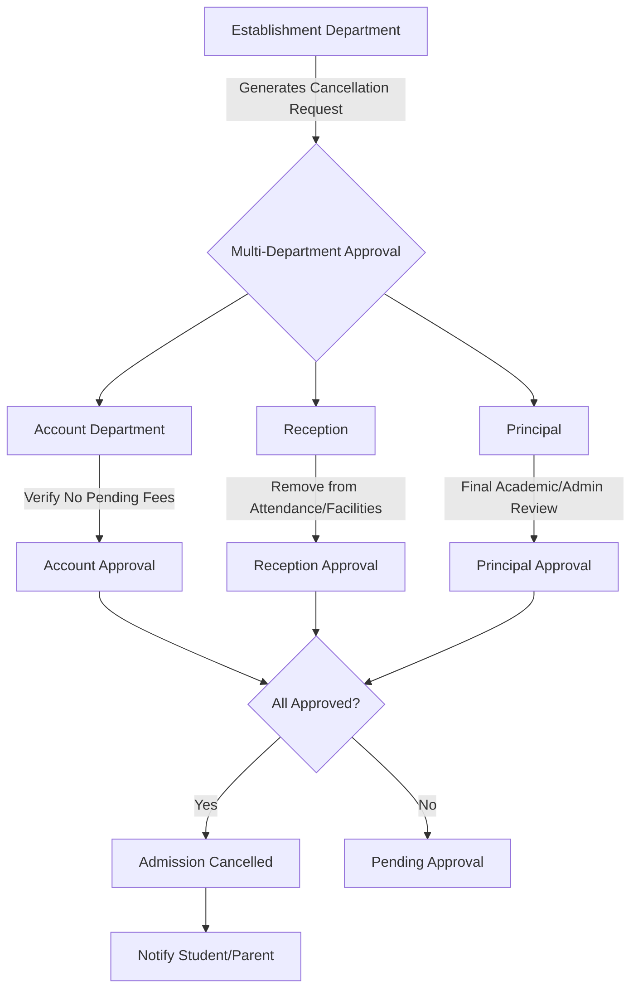

# Establishment Department Workflow Documentation

## Overview
The **Establishment Department** is a core administrative unit responsible for managing the student lifecycle from enrollment to admission finalization or cancellation. This department serves as the primary custodian of student documentation and the initiator of the admission cancellation process.

## Key Responsibilities

### 1. Admission Management
- **Enrollment Oversight:** Manage all newly enrolled students and ensure their transition to fully admitted status.
- **Document Collection:** Collect, verify, and digitize (upload to the portal) all required student documents (e.g., identity proofs, previous academic records, photographs).
- **Confirmation:** Issue official **Confirmation Receipts** to students and parents once all documentation is validated.

### 2. Admission Cancellation
- **Request Initiation:** Generate formal requests for admission cancellation upon student or parent request.
- **Workflow Monitoring:** Track the approval status of cancellation requests across various departments.
- **Finalization:** Confirm the cancellation only after receiving all necessary approvals.

---

## Admission Cancellation Workflow

The cancellation process follows a strict multi-department approval chain to ensure all academic, facility, and financial obligations are settled.

### Workflow Diagram

### Department-Specific Requirements for Cancellation

| Department | Role in Cancellation | Final Approval Criteria |
| :--- | :--- | :--- |
| **Establishment** | Initiator | Ensures the request is properly logged and documentation is updated. |
| **Account** | Financial Verifier | Confirms the student has no outstanding fees or pending payments. |
| **Reception** | Operational Verifier | Confirms the student is removed from attendance registers, transport lists, and other facilities. |
| **Principal** | Final Authority | Provides the ultimate administrative approval for the cancellation. |

> [!IMPORTANT]
> A student remains "Active" in the system until **all three** departments (Principal, Reception, and Account) provide their final approval. The Principal has the final say in the administrative chain.

---

## Technical Considerations for Developers

1. **Role Access:**
   - Establishment Role needs access to Student Document Upload and Confirmation Receipt generation.
   - Establishment Role needs a "Request Cancellation" interface.
   - Principal, Reception, and Account departments need a "Cancellation Requests" dashboard to view and approve pending requests.

2. **Notifications:**
   - When a request is generated, an automated notification should be sent to the Principal, Reception, and Account roles.
   - When all approvals are received, the Establishment Department should be notified to finalize.

3. **Data Integrity:**
   - Cancellation should trigger a status change in the `students` table (e.g., `status = 'cancelled'`).
   - Audit logs must record every step of the approval process, including timestamps and the user who approved.
